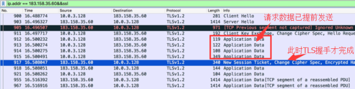
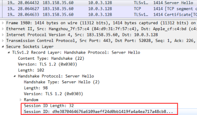

## 说明
1. `Q`代表`question` 问题，`BS`代表`brainstorm` 头脑风暴
2. 结尾用到的工具是`wireshark`

## Q1: 什么是 HTTPS？
### BS: HTTPS 是安全的 HTTP
HTTP 协议中的内容都是明文传输，HTTPS 的目的是将这些内容加密，确保信息传输安全。最后一个字母 S 指的是 SSL/TLS 协议，它位于 HTTP 协议与 TCP/IP 协议中间。

## Q2: 信息传输安全是什么意思?
### BS: 信息传输的安全有两个方面
1. 客户端和服务器直接的通信只有自己能看懂，即使第三方拿到数据也看不懂这些信息的真实含义。
2. 第三方虽然看不懂数据，但可以被修改，因此客户端和服务器必须有能力判断数据是否被修改过。

## Q3: 如何保证信息安全?
### BS: 加密
1. 对称加密，一把密匙，正运算加密，逆运算解密。
2. 非对称加密，公开密钥与私有密钥是一对，如果用公开密钥对数据进行加密，只有用对应的私有密钥才能解密；如果用私有密钥对数据进行加密，那么只有用对应的公开密钥才能解密。

## Q4: 如何加密信息？
### BS: 对称加密

使用一把只有通信双方知道的密钥对信息进行加密传输。

## Q5: 如何保证对称加密的密钥只有通信双方知道？
### BS: 非对称加密

1. `服务器` 生成一对 公钥私钥（非对称加密）
2. `客户端` 从服务器那获取公钥
3. `客户端` 生成一个密钥（对称加密）使用获取的公钥加密该密钥
4. `客户端` 将加密后的密钥发送给服务器
5. `服务器` 用自己的私钥解密 获得该密钥

## Q6: 如何保证服务器不是伪装的？
### BS: 第三方权威机构发放证书
1. `服务器` 向权威机构注册证书，证书中存储了用权威机构私钥加密的公钥
2. `服务器` 将证书发给客户端，客户端 用权威机构的公钥解密，获取服务器的公钥
3. `客户端` 生成一个密钥（对称加密）使用获取的公钥加密该密钥
4. `客户端` 将加密后的密钥发送给服务器
5. `服务器` 用自己的私钥解密 获得该密钥

## Q7: 为什么需要权威机构的公钥？
### BS: 避免证书内容被篡改

权威机构会 先对服务器公钥进行摘要，再用私钥加密生成签名。

1. 证书被劫持，内容被修改，但是签名无法被伪造，因为劫持者没有证书的私钥。

## Q8: 权威机构的公钥哪儿来的？
### BS: 预设在pc中，或者安装根证书

1. 公钥不用传输，会直接内置在操作系统(或者浏览器)的出厂设置里。
2. 足够权威的都被内置，不权威的还得安装。或者该证书被权威机构认证。

## 做个尝试，观察一下真实情况

## 抓包结果

### 解释

|client|server|
|---|---|
|你好||
||你好|
||这是我的证书，里面有我的公钥|
|得到了你的公钥||
|准备加密||
|生成密文||
||准备加密，生成密文|
|...||
||...|
|结束||
||结束|

## TLS 握手
* 客户端发送一个 ``Client hello`` 消息到服务器端，消息中同时包含了它的 Transport Layer Security (TLS) 版本，可用的加密算法和压缩算法。
* 服务器端向客户端返回一个 ``Server hello`` 消息，消息中包含了服务器端的TLS版本，服务器选择了哪个加密和压缩算法，以及服务器的公开证书，证书中包含了公钥。客户端会使用这个公钥加密接下来的握手过程，直到协商生成一个新的对称密钥
* 客户端根据自己的信任CA列表，验证服务器端的证书是否有效。如果有效，客户端会生成一串伪随机数，使用服务器的公钥加密它。这串随机数会被用于生成新的对称密钥
* 服务器端使用自己的私钥解密上面提到的随机数，然后使用这串随机数生成自己的对称主密钥
* 客户端发送一个 ``Finished`` 消息给服务器端，使用对称密钥加密这次通讯的一个散列值
* 服务器端生成自己的 hash 值，然后解密客户端发送来的信息，检查这两个值是否对应。如果对应，就向客户端发送一个 ``Finished`` 消息，也使用协商好的对称密钥加密
* 从现在开始，接下来整个 TLS 会话都使用对称秘钥进行加密，传输应用层（HTTP）内容

## 证书

## 优化
### TLS False Start
浏览器在与服务器完成 TLS 握手前，就开始发送请求数据，服务器在收到这些数据后，完成 TLS 握手的同时，开始发送响应数据。

### Session Identifier（会话标识符）复用
如果用户的一个业务请求包含了多条的加密流，客户端与服务器将会反复握手，必定会导致更多的时间损耗。或者某些特殊情况导致了对话突然中断，双方就需要重新握手，增加了用户访问时间。

>（1）服务器为每一次的会话都生成并记录一个 ID 号，然后发送给客户端；

>（2）如果客户端发起重新连接，则只要向服务器发送该 ID 号；

>（3）服务器收到客户端发来的 ID 号，然后查找自己的会话记录，匹配 ID 之后，双方就可以重新使用之前的对称加密秘钥进行数据加密传输，而不必重新生成，减少交互时间。

### 开启OSCP Stapling，提高TLS握手效率

服务端主动获取 OCSP 查询结果并随着证书一起发送给客户端，从而客户端可直接通过 Web Server 验证证书，提高 TLS 握手效率。

服务器模拟浏览器向 CA 发起请求，并将带有 CA 机构签名的 OCSP 响应保存到本地，然后在与客户端握手阶段，将 OCSP 响应下发给浏览器，省去浏览器的在线验证过程。由于浏览器不需要直接向 CA 站点查询证书状态，这个功能对访问速度的提升非常明显。
